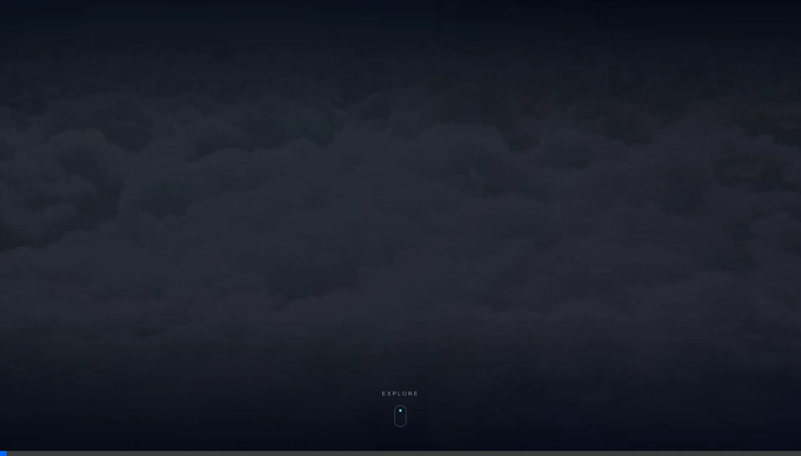

# SZK-AeroX Marketing Website

A premium, cinematic marketing platform for the SZK-AeroX Search & Rescue UAV system. Built with Next.js, Framer Motion, and Tailwind CSS. The site features immersive 3D graphics rendered with Three.js via React Three Fiber, scroll-dependent animations, and a cohesive dark techno-aesthetic layout optimized for user engagement.

## Hero Page & Drone Showcase
The homepage features a dynamic landing experience and interactive 3D drone storytelling.


## Features & 3D Drone Integration
Additional pages natively inject the 3D model for a uniform, high-tech feel.


## Unified Navigation & Multi-Page Layouts
Consistent global navigation and rich features across Use Cases, How It Works, Demo, and Team pages.


## Key Technical Features
- **Next.js App Router**: Lightning-fast React server rendering.
- **Three.js & React Three Fiber**: Interactive 3D drone (`rc_quadcopter.glb`) models integrated natively across the site.
- **Framer Motion**: High-performance cinematic scroll effects, parallax scenes, and page view animations.
- **Tailwind CSS**: Strict custom design tokens (neon cyan `#00eaff`, deep space `#060c18`, and glassmorphic treatments).
- **Responsive Navigation**: A `GlobalNav` sidebar combined with smooth anchor linking and a seamless blended UI.

## Getting Started

1. **Install Dependencies**:
```bash
npm install
```

2. **Run Development Server**:
```bash
npm run dev
```

3. Open [http://localhost:3000](http://localhost:3000) to view the application.

## Project Structure
- `src/app/`: Applications routes (`/features`, `/use-cases`, `/how-it-works`, `/demo`, `/team`).
- `src/components/`: Modular UI elements (`Drone3DSection`, `GlobalNav`, `SimpleDrone`, `HeroScroll`, `PreOrderModal`).
- `public/`: Static assets (3D GLB models, global background textures, simulation videos, frames).
